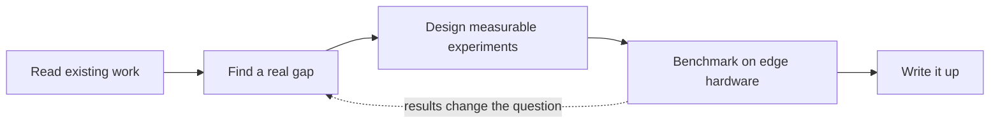

<div align="center">


<br/>

[](https://aniketchakrabortydev.in)
[](https://linkedin.com/in/aniketchakrabortydev)

</div>

> [!NOTE]
> **Open to internships** in AI/ML, Computer Vision, AI Engineering, Edge AI, AIoT and Embedded AI. If you work on on-device vision or want someone who has shipped real software and IoT, message me on LinkedIn.

<br/>

## whoami

```python
class Aniket:
    studying      = "MCA at Dayananda Sagar University (BCA, IEM Kolkata, DGPA 8.52/10)"
    direction     = ["Computer Vision", "Edge AI", "TinyML", "AIoT"]
    background    = "IoT and full-stack engineering, now going deeper into AI/ML"
    strengthening = ["Python", "ML and deep learning fundamentals", "DSA in C++"]
    honest_note   = "Still early in AI/ML. I build in public to close the gap quickly."
    looking_for   = "an AI/ML internship with real production exposure"
```

I don't treat IoT and AI as separate fields. Most interesting problems sit where a sensor produces data, a small model has to understand it, and the answer has to arrive in milliseconds on hardware with almost no memory. That's the part I want to work on.

<br/>

## How I build


<br/>

## Projects

| Project | What it is | Status |
|---|---|---|
| **AI vision assistant for visually impaired users** | Computer vision that helps people understand their surroundings. This is my main research candidate (see below). | Code private for now, architecture write-up and demo planned |
| **Two-way AI fire detection system** | AI-driven fire detection built for real-world alerting. | Code private for now |
| **AI/IoT sandbox system** | A sandbox-style environment for testing AI models together with IoT hardware. | Code private for now |

<!-- TODO: add demo / architecture / write-up links per project as soon as they're public, and replace the one-line descriptions with specifics (models, hardware, results). -->

Some code is private on purpose. What I can share, and will: architecture explanations, demos, benchmarks, documentation and non-sensitive components.

<br/>

## Research track: the vision assistant

I think the vision assistant can grow into a proper paper, so I'm treating it like one.



What I'll measure:

| Metric | Why it matters on-device |
|---|---|
| Accuracy | The system has to be right when someone is relying on it |
| Latency | How long until the user gets guidance |
| FPS | Whether it keeps up with a moving scene |
| Memory and resource use | Whether it fits on constrained hardware |

Numbers will appear here when I've measured them, and not before.

<br/>

## Before the AI focus

**Research Intern, IEM IEDC LAB (2024 to 2026).** IoT for smart-home automation and industrial use cases, performance optimization, TinyML, and neural networks on resource-constrained systems.

**Founder, PujoPlanner.** A full-stack platform that reached 120K+ users, built with React, Node.js, Python, databases and APIs. I'm no longer actively working on it, and it taught me what it takes to run software that real people depend on.

**Study-abroad program, Asian Institute of Technology, Thailand.** Selected for an advanced AI and machine learning program with international students.

<br/>

## Recognition

- Won **5 hackathons**, including **3 MLH hackathons**
- **Best Use of ElevenLabs**, twice
- **Best Scientific Mind**, 2026
- **State-level Gold Medallist**, National Cyber Olympiad

<br/>

## Toolbox

<div align="center">


<br/>


</div>

Also working with: computer vision, neural networks, TinyML, OAuth 2.0, REST APIs, operating systems, database systems and cloud computing. I'm deepening these rather than claiming expert level in all of them.

<br/>

## Activity

<div align="center">


<br/><br/>

<picture>
  <source media="(prefers-color-scheme: dark)" srcset="https://raw.githubusercontent.com/A-N-I-KET/A-N-I-KET/output/github-snake-dark.svg"/>
  <source media="(prefers-color-scheme: light)" srcset="https://raw.githubusercontent.com/A-N-I-KET/A-N-I-KET/output/github-snake.svg"/>
  
</picture>

<br/>

<sub>Measure first, claim later.</sub>

</div>
